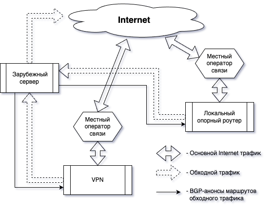

# Domain to NET

Скрипт, формирующий список подсетей из списка доменов

- `Зарубежный сервер`

    - Является NAT-роутером.
    - Формирует и анонсирует по BGP список маршрутов, которые через него должны проходить.

- `Локальный опорный роутер`

    - Является звеном разделения местного трафика.
    - При необходимости может выполнять NAT на IPIP-тоннеле в сторону зарубежного роутера.

    Между Локальным опорным и зарубежным роутером устанавливается IPIP-тоннель
    для корректной работы маршрутизации.

    Дополнительно рекомендуется работу данного IPIP-тоннеля зашифровать, что позволит:

    - спрятать функциональное назначение зарубежного роутера,
    - улучшить прохождение DPI.

## Документация по настройке

- [Установка зарубежного сервера (FreeBSD)](doc/gwout.md)

    Зарубежный сервер, выполняет роль внешнего NAT.

- [Добавление локального опорного на стороне зарубежного сервера](doc/peerlink.md)

    Настройки на зарубежном сервере для обеспечения связности
    с локальным опорным.

- [Настройка локального опорного роутера](doc/local.md)

    Локальный опорный роутер обеспечивает разделения трафика
    на "нативный" (местного оператора) и "обходной" (необходимо отправить
    через зарубежный сервер).
